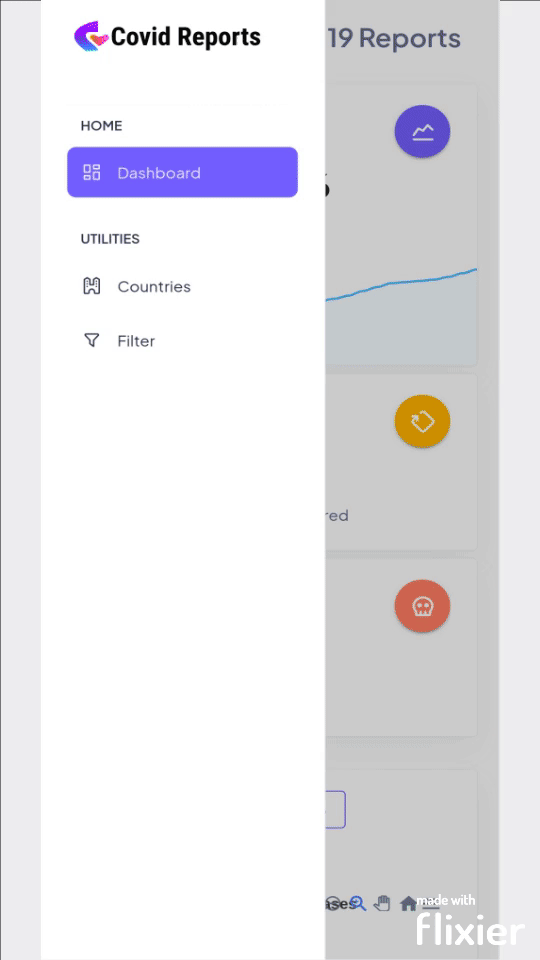
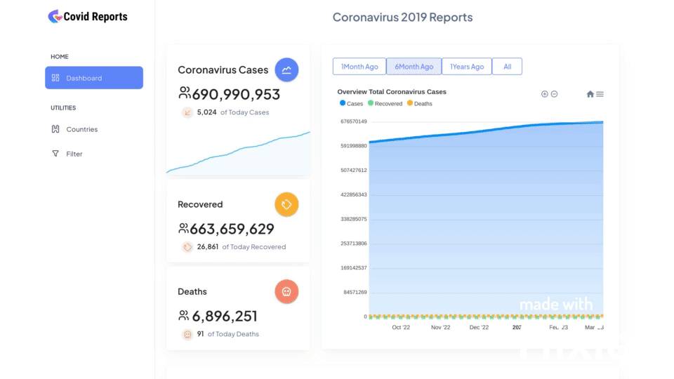

# Nuxt 3 Starter Covid19 Project API Wabsite by Axios

> 💚 **Covid-19 Reports WebApplication(NuxtJS3,Vue3,Typescript)**  is a coronavirus reporting web application designed by Material Design to establish a connection between servers via JSON interface and Axios. Display of overall coronavirus cases, fatalities, and recovered, and also displayed in chart format, used as an ApexChart and displayed as a table that can be filtered to view data from that period of months and years. and can be filtered into a continent

## Demo
Moblie Demo             |  Desktop Demo
:-------------------------:|:-------------------------:
  |  )
### Clone to local

```bash

$>    💿  Install dependencies with `npm install` or `yarn install`
$>
$>    🚀  Start development server with `npm run dev` or `yarn dev`
```

## Setup

### Installation

Make sure to install the dependencies

```bash
yarn install
```

### Development

Start the development server on http://localhost:3000

```bash
yarn dev
```

### Production

Build the application for production:

```bash
yarn build
```
### Credit
```bash
https://disease.sh/docs/*****#/COVID-19%3A%20Worldometers/get_v3_covid_19_all
```

